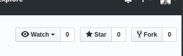
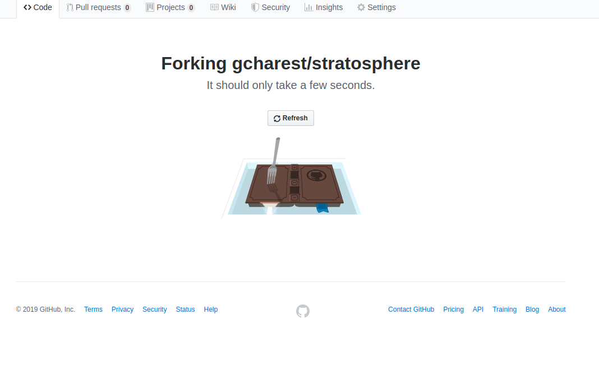
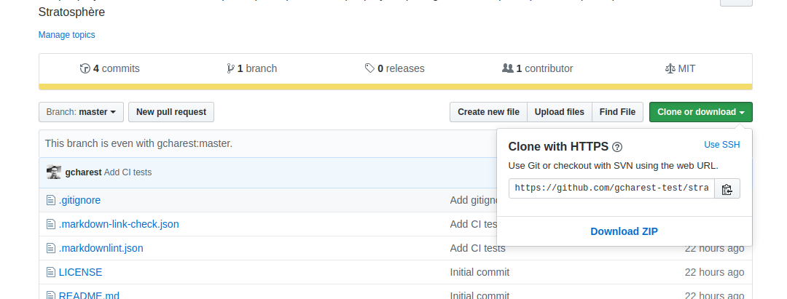

# Git Workshop

## Requirements

You will need a GitHub account for this part.

>Keep your `username` and `password` handy!

## Steps
<!--markdownlint-disable MD029 MD032-->
1. Navigate to [GitHub](https://github.com)
2. Login
3. Go to the following project:
>[https://github.com/gcharest/stratosphere](https://github.com/gcharest/stratosphere)
4. Fork the repository:

5. Wait until it is done Forking

6. Confirm that your are in your own copy of the repository. The url at the top should be your own username instead of `gcharest`:
>`https://github.com/<your_username>/stratosphere`
7. Clone the repository locally:

>`git clone <repository_url> <folder_name> && cd <name>`
8. Add your (or a) name to the list:
>`* <your_name>`
9. Save the changes made to the file
10. Check the status of your changes
>`git status`
11. Add your changes:
>`git add .`
12. Commit your changes:
>`git commit -m "<short commit message>"`
13. Push your changes to your repository:
>`git push`
14. Navigate to your GitHub reposotiry:
15. 
<!--markdownlint-enable MD029 MD032-->
